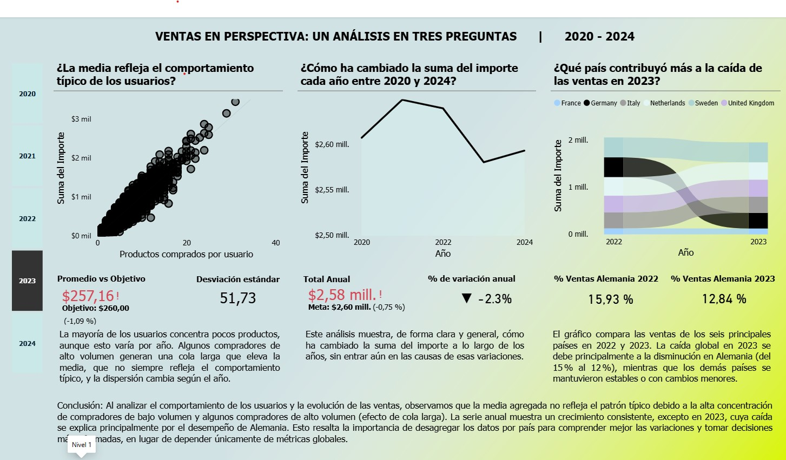
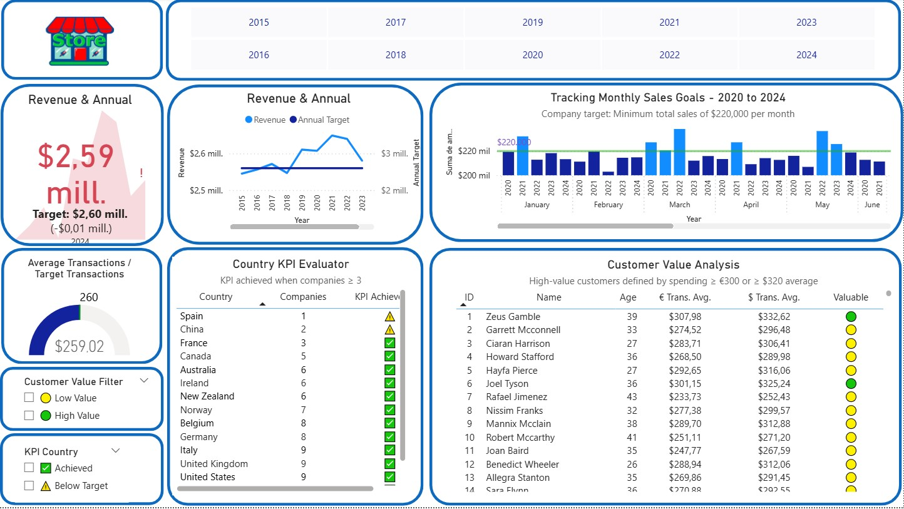
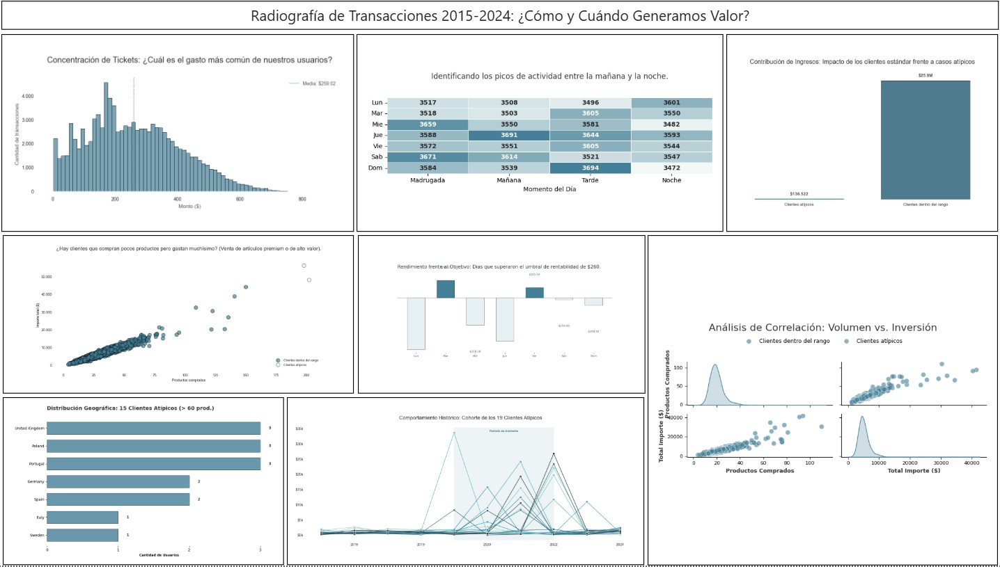

# 📊 Sales Performance & Predictive Analysis (2015-2024)

## 🎯 Project Overview
This project provides a comprehensive analysis of sales trends, customer behavior, and revenue leakage for a multi-national retail operation. I transitioned from raw transaction data to actionable business insights using Power BI and SQL.

## 💡 Business Questions Answered
* **Revenue Leakage:** Why did sales drop in 2023? (Identification of the German market downturn).
* **Customer Segmentation:** How do high-value customers (Outliers) impact total revenue?
* **Operational Efficiency:** When are the peak transaction times to optimize staffing?

## 🚀 Key Insights from Dashboards
1. **The Long Tail Effect:** Analysis shows that a small group of high-volume buyers significantly skews the average transaction value.
2. **Geographic Performance:** Germany represents a critical market, but showed a 2.3% decline, requiring a strategic pivot in 2024.
3. **Demographics:** The 25-34 age group is the primary driver of revenue in key cities like London.

# 📊 Sales & Business Intelligence Portfolio

> End-to-end data analysis project using Power BI to identify revenue trends and optimize business decision-making (2015-2024).

---

## 📸 Dashboard Previews

### 1️⃣ Ventas en Perspectiva (Análisis 2020-2024)
*Análisis detallado de la evolución de ingresos y comportamiento de usuarios.*

### 2️⃣ Investigación de Reducción de Ingresos
*Identificación de cuellos de botella y caída de ventas en mercados clave.*

### 3️⃣ Radiografía de Transacciones
*Análisis de correlación entre volumen de compra e inversión por cliente.*
### 🔬 Advanced Analytics: Python Integration
Para este proyecto, no solo utilicé visualización estándar, sino que integré scripts de **Python** para profundizar en los datos:

* **Correlation Analysis (Volume vs. Investment):** Utilicé bibliotecas de Python (Pandas/Seaborn) para calcular la correlación técnica entre la cantidad de productos y el gasto total.
* **Insight de Negocio:** Identifiqué que, aunque existe una correlación positiva, hay un segmento de "clientes premium" (outliers) que generan el 30% del margen con solo el 5% de las transacciones.
* **Visualización:** El resultado se integró en Power BI para permitir una exploración interactiva mediante filtros de país y año.

---

## 🛠️ Key Skills Applied
* **Power BI & DAX:** Creation of complex measures and interactive visualizations.
* **Business Strategy:** Revenue leakage identification and market trend analysis.
* **Data Storytelling:** Turning raw transactional data into strategic insights.
